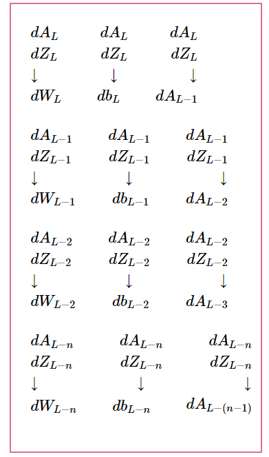

# Neural Networks from Scratch
<!-- 
Neural networks are pretty darn simple... if you know linear algebra and calculus. Once you get those, understanding the algorithms behind neural networks is pretty fun and rewarding. And the great thing is that knowing the building blocks almost makes you a neural network for creating neural networks (You generalize to new problems quite well). I embarked on building linear  -->
## Running the neural network
1. Create and activate a virtual environment in your working directory:<br>
Create: ```python -m venv venv ```.<br>
Activate: ```cd venv/Scripts```. In the "Scripts" dir, type ```activate.bat```<br>
Navigate back to your working directory and install the requirements using `pip install -r requirements.txt`. Head over to the *test.ipynb* file and have fun!
 
## Theory behind deep neural networks
In this repo, we will be creating the multi-layer perceptron network from scratch, understanding the theory and implementing the code from scratch.


<!-- ### Forward Propagation
#### Computing linear 
#### Computing activations
#### Computing loss -->

### Back Propagation
#### Computing Gradient
The first gradient we compute is the that of the output with respect to the loss. When we have this, we propagate it backward throughout the network using the mega boss ***Chain rule***

Here's how to do it.
$$\frac{dLoss}{dA_{outputLayer}} = P$$

Gradients we are interested in:
$$\frac{dL}{dW} = P* \frac{dA_l}{dZ} * \frac{dZ}{dW} \tag{dW}$$

$$\frac{dL}{db} = P * \frac{dA_l}{dZ} * \frac{dZ}{db}  \tag{db}$$

$$\frac{dL}{dA_{l-1}} = P * \frac{dA_l}{dZ} * \frac{dZ}{dA_{l-1}}
\tag{dAprev}$$

$$\frac{dL}{dZ} = P* \frac{dA_l}{dZ}
\tag{dZ}$$

in simpler terms:
$$dW = P * dZ* dW \tag{dW}$$

$$db = P * dZ* db \tag{db}$$

$$dA_{l-1} = P * dZ* dA_{l-1}
\tag{dAprev}$$

but 

$$dZ = P * dZ$$

Thus we simplify the equations even further.
$$
    dW = dZ * dW 
$$

$$
    db = dZ * db 
$$

$$
    dA_{l-1} = dZ * dA_{l-1}
$$

We know that 
$$A_l = g(Z_l)$$

So to get the activation derivative $dZ$ we differentiate with respect to Z as follows.

$$dZ = g'(Z)$$

Similarly, 
$$
    Z = W_{l}A_{l-1} + b_l \tag{5}
$$
so to get the linear derivatives $dW$, $db$,  and $dA_{l-1}$, we just differentiate with respect to the variables $W$, $b$ and $A_{l-1}$.
$$
    dW = A_{l-1} \tag{6}
$$

$$
    db = 1 \tag{7}
$$

$$
    dA_{l-1} = W_l \tag{8}
$$

Substituting  linear derivatives and activation derivatives into our simplified notations we have


$$
dW_l = dZ_l*A_{l-1}
$$

$$db = dZ_l * 1$$

$$
dA_{l-1} = dZ_l * W_l
$$

$$
dZ_l = dA_l*g'(Z_l)
$$

<!-- We can also find a more general form for $dZ_l$ for layers up to $l-1$ -->

<!-- $$dZ_l = W_{l+1}dZ_{l+1}*g'(Z_l)$$
This is the chain rule magic. Thus we only need to know the output layer's dZ which is $P*g'(Z)$ and send it back if you will 😊. -->

The final formulas we will be using for layers 1 up to $l-1$ are as follows.

<!-- $$dZ_{outputLayer} = P*g'(Z_{outputlayer})$$

$$dZ_l = W_{l+1}dZ_{l+1}*g'(Z_l)$$ -->

$$
dZ_L = dA_L*G'(Z)
$$

$$
dW_L = dZ_L*A_{L-1}
$$

$$db_L = dZ_L * 1$$

$$dA_{L-1} = W_L * dZ_L $$

##### Chain rule table visualizer:

|  |
| :--: |
| *Backprop in a nutshell* |


#### Updating the weights and biases
We simply subtract the gradients from the weights and biases respectively. This completes the backward pass step.


### Implementation
The code implementation is found in the deep_nn.py file.


